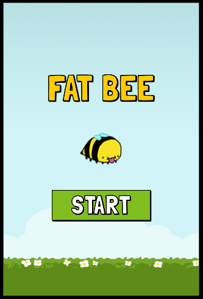
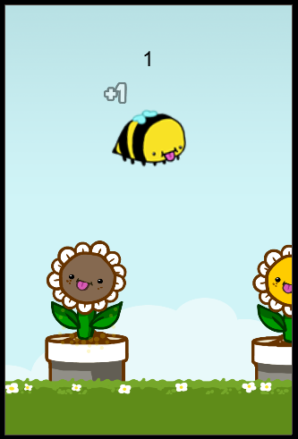
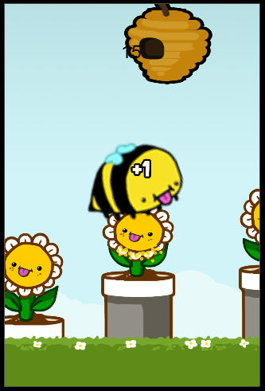
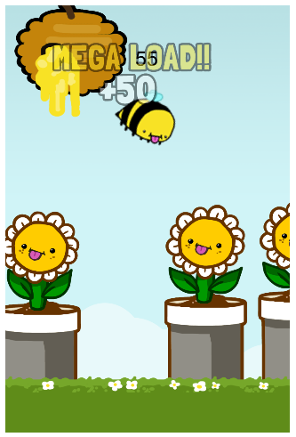
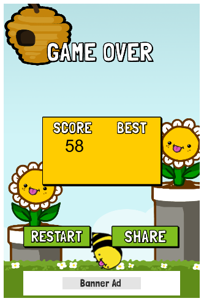

FatBee
======

Requires Corona SDK. 

Gameplay:
FatBee is a Flappy Bird-like physics game in which YOUR taps make the difference between survival and peril for Spartacus the bee! Gathering pollen from flowers makes your bee fat and heavy, so deliver your precious cargo to the hives that pass by. Dodge thieving honeybees. Mash flower faces with your butt. It's a good time for all involved.

I made this spring '14 for the sake of trying out Corona SDK and for the experience of making a physics-based game.

